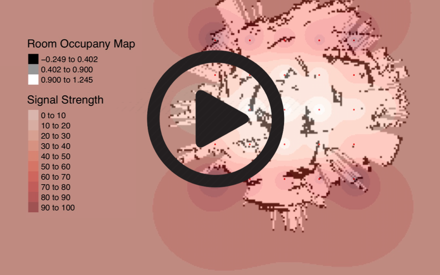

# Signal Strength Mapping


A systematic data-collection system that generates a local-area map overlaid with signal strength data from an autonomous LiDAR system. This package includes a ROS node to run on the master computer that bundles signal and current location data. Additionally, it contains the R-script to process the data and generate a pdf asynchronously. The corresponding ROS node to run on-board is available at [Github](https://github.com/jtbon20/SignalStrengthNode).

## Project Video

[](http://www.youtube.com/watch?v=hceOrScLP7Q "deadspott.r")

## Getting Started

These instructions will get you a copy of the project up and running on your local machine for development and testing purposes. See deployment for notes on how to deploy the project on a live system.

### Prerequisites
 * A [robot](https://medium.com/@taggartbonham/wifi-signal-strength-monitoring-robot-2f7ad74c360a) running [ROS](http://www.ros.org/) with...
  - WiFi-Connectivity
  - [LiDAR](https://en.wikipedia.org/wiki/Lidar)
  - [SLAM](https://ocw.mit.edu/courses/aeronautics-and-astronautics/16-412j-cognitive-robotics-spring-2005/projects/1aslam_blas_repo.pdf) libraries
  - a ROS [node](https://github.com/jtbon20/SignalStrengthNode) that logs signal signal strength
* A new [R](https://www.r-project.org/) installation for statistical processing

### Installing
Detailed [set-up documentation](https://medium.com/@taggartbonham/wifi-signal-strength-monitoring-robot-2f7ad74c360a) for the robot makes use of my [code](https://github.com/jtbon20/SignalStrengthNode) for a signal-strength publishing node.


In order to create this node, we make a new package in our catkin workspace.

```
$ cd ~/catkin_ws/src
src $ catkin_create_pkg signal_gthr std_msgs rospy
```

After this folder's been created, replace the contents of the new folder with the [folder](https://github.com/jtbon20/SignalMapping/tree/master/signal_gthr) in this repository. To deploy our new node, we make our host_posAndSignal.py executable, and then catkin_make this package:

```
$ sudo chmod +x signal_gthr/src/host_posAndSignal.py
$ cd ~/catkin_ws
$ catkin_make
$ rospack profile
```

### Deploying

Now you are ready to run the host_posAndSignal.py script. Locate a folder to save the data output.


Initialize ROS, and bringup the robot and your [wifi node](https://github.com/jtbon20/SignalStrengthNode) of choice.
```
host$ roscore
```

For specific launch instructions on the TurtleBot3, the platform used in my build of this project, see their [website](http://emanual.robotis.com/docs/en/platform/turtlebot3/overview/).

```
deadspottr$ roslaunch turtlebot3_bringup turtlebot3_robot.launch
deadspottr$ rosrun single_sig_test signal_strength.py
```

We now launch the signal_gthr node we just constructed on the host computer.

```
host$ roslaunch turtlebot3_slam turtlebot3_slam.launch
host$ rosrun rviz rviz -d `rospack find turtlebot3_slam`/rviz/turtlebot3_slam.rviz
host$ roslaunch turtlebot3_teleop turtlebot3_teleop_key.launch
```

To begin data-collection, run:

```
host$ rostopic echo -p /signal_dtagthr > /Path/to/output/file.txt
```

To check your set-up, run `host$ rosrun rqt_graph rqt_graph` to check your [RQT-Graph](http://wiki.ros.org/rqt_graph) against the proper set-up below.


## Usage
### Data Collection
Now that the nodes are running, allow the robot to drive around the area you are trying to map.


After you are satisfied with the local area map, save the resulting map into the data folder, where we've been saving the publishings of the /signal_dtagthr topic.
```
host$ rosrun map_server map_saver -f map
```

### Data Processing
To process these files into an output map, we now run the R script.

```
host$ r -f /Path/to/GenerateSignalMap.R
```

Because this script can run from any location, you will be prompted twice to enter the location of the data files that we collected.
When promped, enter the direct path to the file or folder asked. If this does not work, you can hard-code the path locations directly into the script.

The final generated file will be in the folder of the R script and be pdf file titled Rplots.pdf.


## Built With

* [ROS](http://www.ros.org/) - Open Source Robotic Software Platform
* [TurtleBot3](http://emanual.robotis.com/docs/en/platform/turtlebot3/overview/) - Robotic Hardware Platform
* [R](https://www.r-project.org/) - Open Source Statistical Software
